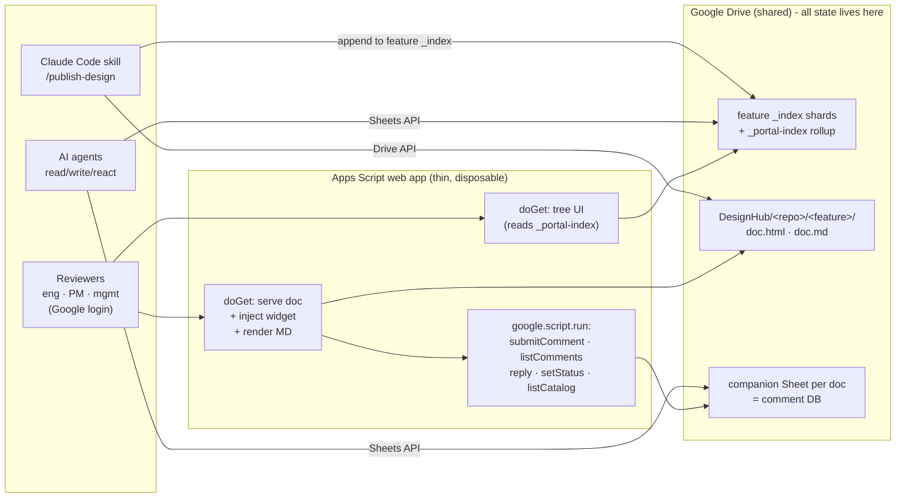

# DesignHub - design proposal (DRAFT for review)

> **Status: draft v0.1 · 2026-07-02 · open for comments**
> A platform for publishing HTML/MD design docs from our repos to a Google-login-gated
> hub, collecting in-page feedback from the whole company (including PMs and management
> without GitHub accounts), and growing into TechSee's org knowledge portal.
>
> Visual version: [`design.html`](./design.html) - or review it with cc-htmlfeedback itself:
> `node server.js --root docs/designhub` and comment away.

## 1. The problem

1. **Design docs are invisible where they live.** Agents and engineers produce rich HTML
   dashboards and MD plans inside repos (see PR #1 in this repo for a live example) -
   GitHub shows HTML as source code, renders MD without interactivity, and both require
   a GitHub seat to view.
2. **Half the reviewers have no GitHub.** PMs, CS, and management have Google accounts
   only. Today they get screenshots or nothing.
3. **cc-htmlfeedback solved review UX, single-player only.** Highlight-to-comment with
   quote/context anchoring is exactly the right interaction, but it is local-machine,
   anonymous, and its comments are disposable ([how it works](../how-it-works.md)).
4. **Org knowledge is scattered.** Docs, Slides, and Sheets full of knowledge exist all
   over Drive with no shared structure, taxonomy, or index.

## 2. Decisions so far (the log)

| # | Decision | Choice | Rationale |
|---|---|---|---|
| D1 | Audience & identity | Eng (GitHub + Google), PMs/mgmt (Google only), AI agents as first-class actors | Feedback must work with only a Google login; agents read/write/react to comments programmatically |
| D2 | Canonical comment store | **Google Sheet per doc is the DB / source of truth** | Rich ticket model (anchors, status, threads, author) that GitHub comment bodies would mangle; native to Workspace; PMs can literally open it; agents get it via one API |
| D3 | GitHub sync | Explicit **Sync button**, phase 2. Syncs into an **open PR**: closed PR found → "PR #N is closed - open a new one"; no PR at all → explain there's nothing to sync to yet and offer to open a new PR for the doc | Deliberate batching instead of notification spam; sheet's role stays crisp (always-on store), GitHub is strictly the review-time mirror; no unsolicited PRs - guide to a PR instead of refusing |
| D4 | Runtime | **Approach C**: pure Apps Script v1, designed to graduate to any host later | Zero infra/cost/ops now; evidence-based exit later |
| D5 | Cloud independence | **Hard rule: Google Workspace only, no cloud assumed.** Future serving = any host on any cloud talking Drive/Sheets REST APIs | Drive works with any cloud; the platform must not marry one |
| D6 | Publishing | **Claude Code skill on demand** (`/publish-design`) | Human/agent-triggered, no per-repo config; CI wrapper can come later against the same contract |
| D7 | V1 scope | Publish + view + tree · in-page comments → Sheet · agent comment access. **PR sync deferred to phase 2** | Removes all GitHub-write integration from v1 |
| D8 | Portal trajectory | DesignHub is **module 1 of an org knowledge portal**; navigation is catalog-driven from day one | Existing Docs/Slides/Sheets get registered into the same catalog later without redesign |
| D9 | Publish metadata defaults | Skill infers repo/branch/feature/jira from **git + session context**, shows resolved values for **user approval** before publishing; anything unknown gets the explicit placeholder **`unassigned`** | No silent guessing - the publisher confirms; `unassigned` is greppable and can't be mistaken for a real value |
| D10 | MD rendering | **Client-side for v1** (bundled renderer at view time); revisit server-side only if output quality demands | Zero server work, one less moving part; easy to swap later |
| D11 | Permissions | **Whole-domain read for v1** via one shared folder. Native Drive ACLs can be tightened manually per repo/feature folder anytime | Caveat: the web app executes as the publisher account, so once folders are tightened, the serving layer must also check the viewer's Drive access before serving - v1 domain-wide read avoids that code |
| D12 | Comment lifecycle | V1 ships `open → in-progress → resolved/declined` as-is; richer states (`acknowledged` etc.) are **out of scope for v1**. V2 candidates: sort comments by creation date / update date | Don't overdesign the lifecycle before real usage; sorting emerged as a concrete v2 need |
| D13 | Accounts | **Developers publish as themselves** - the skill uses their own Google OAuth, `owner` = their email. The **web app script owner** starts as Igor's account, migrates to a dedicated `designhub@` later | Script owner only affects what account serves files and whose quota is used - never authorship; publishing and serving are separate roles |
| D14 | Naming | **Filenames stay original** - whatever the file is called in the repo (or whatever the publisher chose). No versions in filenames: version/date belong **inside the doc content** and in index metadata (`updatedAt`, Drive revisions) | Renaming on publish breaks the repo ↔ Drive mapping; Drive revisions + the index already track versions |
| D15 | Re-publish vs comments | Open comments whose quoted text is gone in the new version are **auto-resolved with the distinct terminal status `anchor-lost`** - clearly marked as *not fixed*, never confused with `resolved`. The publish flow runs the re-anchor check (same quote search the widget uses) and writes the status. Good enough for v1; collect feedback and refine later | No manual triage burden in v1; the separate status keeps auto-closed feedback honest, filterable, and recoverable (reopen = new comment or status flip) |

## 3. Architecture (v1)



**The load-bearing rule:** everything of value lives in Drive + Sheets under documented,
runtime-agnostic contracts; Apps Script is a thin serving layer that could be deleted
tomorrow with zero data loss. Concretely:

1. **One standalone Apps Script web app** - deployed "execute as me" (dedicated publisher
   account eventually), access "anyone in the Workspace domain". Reviewer identity comes
   free from `Session.getActiveUser().getEmail()` - reliable because access is
   domain-restricted. No OAuth prompts for viewers, no tokens in the browser.
2. **Serving** - `?doc=<path>` reads the file from Drive, injects the adapted widget
   (same trick as cc-htmlfeedback's `inject.js`), returns via `HtmlService`. MD is
   rendered to HTML at view time (client-side, bundled renderer - D10), then gets the
   same widget - PMs comment on rendered Markdown exactly like on HTML.
3. **Comments** - widget → `google.script.run` bridge (no CORS, no endpoints to secure)
   → append row to the doc's Sheet. Each bridge function is deliberately shaped like a
   REST endpoint so a future non-Google host implements the same five calls.
4. **Agents** - no custom API in v1: **the Sheet is the API.** Agents use Drive/Sheets
   REST with normal OAuth creds (from Claude Code, CI, or any cloud) against a
   documented schema. They get **full context at three levels**, all from existing
   contracts: *structured* - comments via Sheets REST, each carrying the
   quote/context/section anchor triple that locates it in the doc text; *source* - the
   byte-exact doc via Drive REST; *visual* - the agent renders the fetched doc in a
   local browser tool (dev-browser, Playwright) and locates the anchors on the rendered
   page before acting. No Google login needed: the file comes from the Drive API -
   agents never touch the web app.
5. **Anti-lock-in discipline** - no `PropertiesService`/`CacheService` as data stores,
   no Apps-Script-only formats.

### Layering

```
Catalog   - what exists and how it is organized   (feature _index shards + derived _portal-index)
Storage   - the assets and their conversations    (Drive files + comment Sheets)
Serving   - thin and disposable                   (Apps Script now, anything later)
```

## 4. The Catalog - sharded indexes + derived portal rollup

**Source of truth is sharded per feature**, matching the physical folders: each
`DesignHub/<repo>/<feature>/_index` Sheet lists that feature's docs, and the publish
skill only ever writes its own feature's index. Small blast radius, per-repo/feature
ACLs possible, stays manageable as the org grows.

**The org-wide view is a derived rollup** - `DesignHub/_portal-index`, rebuilt
automatically from the shards (on publish + a periodic Apps Script trigger). It is a
**disposable cache, not a source of truth**: corrupt it, delete it, regenerate it -
nothing is lost. Portal search, cross-repo views, and agents read this single queryable
surface (the classic materialized-view pattern).

Index row schema (same in shards and rollup; the rollup adds nothing):

| column | v1 use | portal use |
|---|---|---|
| `id` | uuid | same |
| `type` | `html` \| `md` | + `gdoc` \| `gslides` \| `gsheet` \| `link` |
| `title` | doc title | same |
| `repo` | source repo | optional (native Drive assets have none) |
| `feature` | branch / feature name | topic / area |
| `jira` | ticket key(s) | same |
| `tags` | free-form | primary navigation facet |
| `owner` | publisher email | document owner |
| `driveFileId` | published file | existing Drive file |
| `url` | view URL | native viewer URL for Google types |
| `status` | `active` \| `archived` | same |
| `publishedAt` / `updatedAt` | timestamps | same |

- **v1:** the publish skill writes only its feature's `_index` (and pokes the rollup
  refresh); the tree UI reads the `_portal-index` rollup grouped by `repo/feature`.
  Folders stay `repo/feature` as physical storage, but **navigation reads indexes, not
  folders**.
- **Portal phase:** existing Docs/Slides/Sheets are registered as index rows pointing at
  their current Drive files, opened in native viewers (no serving or widget needed). Same
  tree, same search, same taxonomy across published designs and existing content. A bulk
  importer can register an entire Drive folder.
- **Taxonomy lives in index columns, not folder paths** - browsing by team, epic, or
  product area later is just another view over the rollup. No file moves, no redesign.
- **Why sharded shards + one derived rollup (not one master sheet, and not shards
  alone)?** Sharding the writes keeps each index small, manageable as the org grows, and
  ACL-able per repo/feature, with a tiny blast radius - while cross-repo search and the
  portal still need a single queryable surface, and a per-shard scatter-gather on every
  tree load would be slow. The rollup gives that surface as a regenerable cache: writes
  stay clean and distributed, reads stay unified, and losing the rollup costs a rebuild,
  not data. (Per-PR indexes were rejected outright: PRs are ephemeral, docs outlive
  them - D3.)

## 5. Data contracts (runtime-agnostic core)

### Drive tree

```
DesignHub/                          (shared folder or Shared Drive)
  _portal-index                     (Sheet - derived rollup, disposable cache)
  <repo>/
    <feature-or-JIRA>/              e.g. HELM-123-crm-evaluation
      _index                        (Sheet - this feature's docs, source of truth)
      dashboard.html                published doc, byte-exact source
      dashboard.comments            (Sheet - this doc's comment DB)
```

### Comment Sheet - `tickets` tab

Schema carried over from cc-htmlfeedback's ticket, extended for multi-user review:

| column | notes |
|---|---|
| `id` | uuid |
| `parentId` | empty = top-level; set = reply (threading) |
| `type` | `comment` \| `strike` \| `reply` |
| `status` | `open` → `in-progress` → `resolved` \| `declined` \| `anchor-lost` (auto-set on re-publish when the quote is gone - D15) |
| `quote` / `context` / `section` | the cc-htmlfeedback anchor triple |
| `note` | the comment text |
| `authorEmail` / `authorName` | from Google session (or agent identity) |
| `source` | `web` \| `agent` |
| `docVersion` | catalog `updatedAt`/revision at comment time |
| `result` / `files` | filled by agents when they act on a ticket |
| `createdAt` / `updatedAt` | timestamps |

A `meta` tab holds: repo, path-in-repo, branch, commit SHA, PR number, jira, publisher,
publish history (one row per re-publish).

### Bridge functions (v1) = future REST surface

| bridge (Apps Script) | future REST |
|---|---|
| `listCatalog(filter)` | `GET /catalog` |
| `getDoc(path)` | `GET /docs/{path}` |
| `submitComment(ticket)` | `POST /docs/{path}/comments` |
| `listComments(path)` | `GET /docs/{path}/comments` |
| `reply(parentId, note)` | `POST /comments/{id}/replies` |
| `setStatus(id, status)` | `PATCH /comments/{id}` |

## 6. What we reuse from cc-htmlfeedback

| piece | reuse |
|---|---|
| Widget UX (highlight → popover → comment/strike) | ~80% as-is |
| Anchor triple (quote/context/section) + re-anchoring | as-is |
| Ticket schema | extended (author, threading, source) |
| Transport (`fetch /__ccfb/*` + SSE) | replaced by `google.script.run` bridge; SSE dropped in v1 (no live agent loop on-page) |
| Injection (`inject.js`) | same pattern, server-side in GAS |
| Local fix loop (server.js, watch-inbox, boards) | not used - replaced by Sheet + agents pulling from it |

## 7. Scope

### V1 (must-have)
- `/publish-design` Claude Code skill: upload HTML/MD + metadata via Drive API, upsert
  the feature `_index` row (+ trigger rollup refresh), create companion Sheet, return
  the shareable link
- Google-login-gated viewing: HTML served with widget; MD rendered then widget-ized
- Tree UI over the `_portal-index` rollup (repo/feature grouping)
- In-page comments → Sheet, with Google identity, threading, statuses
- Agent access: documented Sheet schema + Drive/Sheets API how-to + local render
  recipe for visual context (fetch doc + comments, locate anchors, render locally
  for visual review)

### Phase 2
- **Sync-to-PR button** (per D3: open PR required), eng identity vs bot + "on behalf of"
- Quote → source-line mapping for inline PR review comments; plain PR comment fallback
- Comment-driven agent fix loop (agent reads open tickets, applies fixes, re-publishes)
- Richer comment lifecycle (e.g. `acknowledged`) + comment sorting by creation / update
  date (D12 candidates)

### Phase 3 - the knowledge portal
- Register existing Docs/Slides/Sheets into the catalog (bulk importer)
- Tag/team/epic navigation facets, search
- Portal home replacing the v1 tree UI

## 8. Open questions (comment here!)

None right now - everything raised during review became a decision (D1-D15). Comment
on the published doc to open new ones.

## 9. Verification plan

- **Spike first (riskiest assumption):** serve a real design HTML (the CRM dashboard)
  through HtmlService with the widget active - confirm rendering fidelity and
  `google.script.run` comment round-trip inside the iframe sandbox. Half a day;
  validates or kills Approach C's v1 while switching is still free.
- Widget adaptation tested against the cc-htmlfeedback playground page.
- Publish skill: idempotent re-publish, feature `_index` upsert + rollup refresh, link correctness.
- Agent path: a Claude Code session reads open tickets from a Sheet and posts a reply,
  using only documented contracts.
