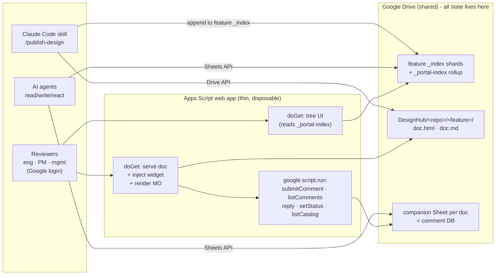

# DesignHub - design proposal (DRAFT for review)

> **Status: v1 implemented · spike-validated (see pocs/) · 2026-07-05 draft accepted**
> A platform for publishing HTML/MD design docs from our repos to a Google-login-gated
> hub, collecting in-page feedback from the whole company (including PMs and management
> without GitHub accounts), and growing into an org knowledge portal.
>
> Visual version: [`design.html`](./design.html) - or review it with cc-htmlfeedback itself:
> `node server.js --root docs/designhub` and comment away.

## 1. The problem

1. **Design docs are invisible where they live.** Agents and engineers produce rich HTML
   dashboards and MD plans inside repos (see PR #1 in this repo for a live example) -
   GitHub shows HTML as source code, renders MD without interactivity, and both require
   a GitHub seat to view.
2. **Half the reviewers have no GitHub.** PMs, CS, and management have Google accounts
   only. Today they get screenshots or nothing.
3. **cc-htmlfeedback solved review UX, single-player only.** Highlight-to-comment with
   quote/context anchoring is exactly the right interaction, but it is local-machine,
   anonymous, and its comments are disposable ([how it works](../how-it-works.md)).
4. **Org knowledge is scattered.** Docs, Slides, and Sheets full of knowledge exist all
   over Drive with no shared structure, taxonomy, or index.

## 2. Decisions so far (the log)

| # | Decision | Choice | Rationale |
|---|---|---|---|
| D1 | Audience & identity | Eng (GitHub + Google), PMs/mgmt (Google only), AI agents as first-class actors | Feedback must work with only a Google login; agents read/write/react to comments programmatically |
| D2 | Canonical comment store | **Google Sheet per doc is the DB / source of truth** | Rich ticket model (anchors, status, threads, author) that GitHub comment bodies would mangle; native to Workspace; PMs can literally open it; agents get it via one API |
| D3 | GitHub sync | Explicit **Sync button**, phase 2. Syncs into an **open PR**: closed PR found → "PR #N is closed - open a new one"; no PR at all → explain there's nothing to sync to yet and offer to open a new PR for the doc | Deliberate batching instead of notification spam; sheet's role stays crisp (always-on store), GitHub is strictly the review-time mirror; no unsolicited PRs - guide to a PR instead of refusing |
| D4 | Runtime | **Approach C**: pure Apps Script v1, designed to graduate to any host later | Zero infra/cost/ops now; evidence-based exit later |
| D5 | Cloud independence | **Hard rule: Google Workspace only, no cloud assumed.** Future serving = any host on any cloud talking Drive/Sheets REST APIs | Drive works with any cloud; the platform must not marry one |
| D6 | Publishing | **Claude Code skill on demand** (`/publish-design`) | Human/agent-triggered, no per-repo config; CI wrapper can come later against the same contract |
| D7 | V1 scope | Publish + view + tree · in-page comments → Sheet · agent comment access. **PR sync deferred to phase 2** | Removes all GitHub-write integration from v1 |
| D8 | Portal trajectory | DesignHub is **module 1 of an org knowledge portal**; navigation is catalog-driven from day one | Existing Docs/Slides/Sheets get registered into the same catalog later without redesign |
| D9 | Publish metadata defaults | Skill infers repo/branch/feature/jira from **git + session context**, shows resolved values for **user approval** before publishing; anything unknown gets the explicit placeholder **`unassigned`** | No silent guessing - the publisher confirms; `unassigned` is greppable and can't be mistaken for a real value |
| D10 | MD rendering | **Client-side for v1** (bundled renderer at view time); revisit server-side only if output quality demands. Bundle must include **mermaid** support - design docs (like this one) use mermaid blocks | Zero server work, one less moving part; easy to swap later |
| D11 | Permissions | **Whole-domain read for v1** via one shared folder. **Tightening folder ACLs is NOT supported until the serving-layer viewer check ships** (same milestone): the web app serves as the owner account, so a manually tightened folder would still be served to any domain user - a silent leak, not protection. V1 contract: publish only what the whole domain may read | Native Drive ACLs make tightening *look* available, but owner-serving bypasses them; pairing ACL support with the viewer-access check keeps the contract honest |
| D12 | Comment lifecycle | V1 ships `open → in-progress → resolved/declined` as-is; richer states (`acknowledged` etc.) are **out of scope for v1**. V2 candidates: sort comments by creation date / update date | Don't overdesign the lifecycle before real usage; sorting emerged as a concrete v2 need |
| D13 | Accounts | **Developers publish as themselves** - the skill uses their own Google OAuth, `owner` = their email. Publish *write* access is a **one-time setup grant, not per-publish**: the **`designhub-publishers@` group** holds editor (content-manager) rights on the DesignHub root, so any developer or CI identity in the group can create feature folders, upload docs, and upsert `_index` shards with its own credentials. The **web app script owner** starts as a personal admin account, migrates to a dedicated `designhub@` service user later. The publish skill **grants editor access on the companion Sheet and feature `_index`** it creates to two writers: the **serving account** (reviewer comments go through the bridge as that account) and the **`designhub-agents@` Google group** - any agent identity (CI bot, another developer's session) joins the group once and writes via Sheets REST as itself | Script owner only affects what account serves files and whose quota is used - never authorship; publishing and serving are separate roles. Whole-domain sharing (D11) is read-only, so without the publishers group every non-owner's very first Drive write would fail, and without the agents group a non-publisher agent's reply/status writes would fail with Sheets permission errors |
| D14 | Naming | **Filenames stay original and the repo-relative subpath is preserved** under the feature folder (`docs/api/design.md` → `<feature>/docs/api/design.md`), so identical basenames never collide. The `<feature>` folder is a **single sanitized path component**: path separators in branch names are encoded (`feature/new-ui` → `feature--new-ui`) so a slashed branch can never collide with a real repo subdirectory; the `_index` `feature` column keeps the original string, and publishing into an existing folder whose `_index` records a *different* original feature **fails loudly** instead of silently merging two features. No versions in filenames: version/date belong **inside the doc content** and in index metadata (`updatedAt`, Drive revisions) | Renaming on publish breaks the repo ↔ Drive mapping; subpath mirroring is collision-proof by construction *only* if the feature segment can't itself contain separators; Drive revisions + the index already track versions |
| D15 | Re-publish vs comments | The publish flow runs the re-anchor check on **every non-terminal ticket (`open` *and* `in-progress`)** using the **full anchor triple** (quote + context + section - a bare quote match at a different occurrence counts as lost, unlike the widget's quote-only search). Quote gone → **`anchor-lost`**, a distinct terminal status clearly marked as *not fixed*, never confused with `resolved` - an `in-progress` ticket someone was mid-work on surfaces as lost instead of dangling anchorless forever. **Exception - `strike` tickets:** the quoted text disappearing *is* the requested fix, so a strike whose quote is gone auto-closes as **`resolved`** (with `result` = auto-verified on re-publish), not `anchor-lost`. Good enough for v1; collect feedback and refine later | No manual triage burden in v1; the separate status keeps auto-closed feedback honest, filterable, and recoverable (reopen = new comment or status flip); the strike branch keeps accepted deletions from being misfiled as losses |
| D16 | Repo strategy | **Monorepo in the fork**, sync-safe: DesignHub lives in additive-only paths (`designhub/`, `plugins/designhub/`) and **never edits upstream files** (sole exception: a 5-line `marketplace.json` entry). The widget variant is generated by our own **fail-loud build transform** (`designhub/build-designhub.js`) from upstream's untouched `feedback-widget.html`. Sync = `git merge upstream/main` + rebuild + tests (never GitHub's "Sync fork" button); a fork-side CI check runs build + tests on every merge. Long-term: offer the transport-adapter refactor upstream | Single widget source keeps UX improvements flowing to both products; additive paths make upstream merges conflict-free indefinitely; the one brittle joint (transport transform) fails loudly at build time, not silently |
| D17 | Doc scripts vs the bridge | Published HTML runs its own scripts in the same HtmlService page as the widget, so doc code **can call the privileged `google.script.run` bridge**. **V1 contains rather than isolates**: (a) the bridge surface is comment-Sheet-rows only and must never grow broader capabilities; (b) every mutating call stamps `authorEmail` server-side from `Session.getActiveUser()` - client-supplied identity is ignored, so a doc script can only write rows attributed to the current viewer; (c) status changes are appended to the publish/audit history, making forged activity detectable and reversible; (d) v1 publishers are trusted domain developers (D11). **True isolation - doc content in a sandboxed iframe (`sandbox` without `allow-same-origin`), widget talking to it via `postMessage` - is a stated precondition for accepting content from beyond trusted repos**, and for the serving-layer graduation | A sandboxed content frame breaks the widget's direct selection/anchoring model - too costly for v1. Capping the bridge's blast radius + server-side attribution + audit keeps the worst case at "attributable comment noise from a doc a trusted colleague published", which is acceptable while publishing stays inside the domain |
| D18 | Storage root & v1 access grants | **Shared Drive** as the DesignHub root (decided 2026-07-05). V1 access = **Shared Drive membership, not per-Sheet grants**: publishers are Content managers, each agent identity (first: the agent account recorded in `plans/environment.local.md`, local-only) is added once as Contributor, the serving account as Contributor too. The publish skill makes **no `permissions.create` calls**. D13's `designhub-publishers@`/`designhub-agents@` groups are **deferred**: they become the membership *targets* (one group added to the drive instead of N users) only when identity churn justifies admin-managed groups - the authorship model of D13 (publish as yourself, agents write as themselves) is unchanged. Whole-domain *read* (D11) on a Shared Drive has different sharing semantics than My Drive - verified as part of the publish-surface POC | Org-owned root survives offboarding and personal-quota entanglement; drive-level membership gives the join-once grant the groups were invented for, with zero Workspace-admin work for v1; fewer moving parts in the publish flow |
| D19 | Rollup refresh mechanism | The publish skill **upserts the `_portal-index` row directly via Sheets REST** in the same flow as the feature-shard write (new keys via the atomic `values:append` - concurrent publishes of distinct docs cannot clobber each other); the periodic Apps Script trigger runs the **reconciler**: a full rebuild from `_index` shards implemented as pure JS (`node --test`-able per D5), which converges after any missed write, same-key race duplicate, or outright rollup corruption. **No skill→web-app call exists at all.** Reconciler interval: hourly to start, tune with usage | Validated in POC-5 against the real Shared Drive: idempotent upserts, parallel-publish safety, and clear-then-rebuild convergence all proven; the skill already holds Sheets creds and the exact row, while CLI→GAS-web-app auth is a project of its own - eliminating the call removes the whole problem; rebuild-from-shards keeps the rollup honest as a disposable cache (§4) |

## 3. Architecture (v1)



**The load-bearing rule:** everything of value lives in Drive + Sheets under documented,
runtime-agnostic contracts; Apps Script is a thin serving layer that could be deleted
tomorrow with zero data loss. Concretely:

1. **One standalone Apps Script web app** - deployed "execute as me" (dedicated publisher
   account eventually), access "anyone in the Workspace domain". Reviewer identity comes
   free from `Session.getActiveUser().getEmail()` - reliable because access is
   domain-restricted. No OAuth prompts for viewers, no tokens in the browser.
2. **Serving** - `?doc=<path>` reads the file from Drive, injects the adapted widget
   (same trick as cc-htmlfeedback's `inject.js`), returns via `HtmlService`. MD is
   rendered to HTML at view time (client-side, bundled renderer - D10), then gets the
   same widget - PMs comment on rendered Markdown exactly like on HTML. Injection also
   sets `<base target="_top">` (and rewrites bare anchors) - HtmlService's IFRAME
   sandbox requires explicit link targets or in-doc links silently fail to navigate.
3. **Comments** - widget → `google.script.run` bridge (no CORS, no extra HTTP endpoints
   to run) → append row to the doc's Sheet. Doc scripts share the HtmlService page and
   can reach the bridge too - D17 defines the containment contract (comment-rows-only
   surface, server-side identity stamping, audit trail). Each bridge function is
   deliberately shaped like a REST endpoint so a future non-Google host implements the
   same six calls.
4. **Agents** - no custom API in v1: **the Sheet is the API.** Agents use Drive/Sheets
   REST with normal OAuth creds (from Claude Code, CI, or any cloud) against a
   documented schema. They get **full context at three levels**, all from existing
   contracts: *structured* - comments via Sheets REST, each carrying the
   quote/context/section anchor triple that locates it in the doc text; *source* - the
   byte-exact doc via Drive REST; *visual* - the agent renders the fetched doc in a
   local browser tool (dev-browser, Playwright) and locates the anchors on the rendered
   page before acting. No Google login needed: the file comes from the Drive API -
   agents never touch the web app. Read access comes with domain-wide sharing (D11);
   **write access comes from D18**: agent identities are one-time members (Contributor)
   of the DesignHub Shared Drive, so a CI bot or a developer who isn't the publisher
   writes as itself with no per-Sheet grants (D13's groups are deferred - they become
   the membership target only if identities churn).
5. **Anti-lock-in discipline** - no `PropertiesService`/`CacheService` as data stores,
   no Apps-Script-only formats.

### Layering

```text
Catalog   - what exists and how it is organized   (feature _index shards + derived _portal-index)
Storage   - the assets and their conversations    (Drive files + comment Sheets)
Serving   - thin and disposable                   (Apps Script now, anything later)
```

## 4. The Catalog - sharded indexes + derived portal rollup

**Source of truth is sharded per feature**, matching the physical folders: each
`DesignHub/<repo>/<feature>/_index` Sheet lists that feature's docs, and the publish
skill only ever writes its own feature's index. Small blast radius, per-repo/feature
ACLs possible, stays manageable as the org grows.

**The org-wide view is a derived rollup** - `DesignHub/_portal-index`, rebuilt
automatically from the shards (on publish + a periodic Apps Script trigger -
mechanism settled in D19: direct upsert by the publish skill, reconciler rebuild
on the trigger). It is a
**disposable cache, not a source of truth**: corrupt it, delete it, regenerate it -
nothing is lost. Portal search, cross-repo views, and agents read this single queryable
surface (the classic materialized-view pattern).

Index row schema (same in shards and rollup; the rollup adds nothing):

| column | v1 use | portal use |
|---|---|---|
| `id` | uuid | same |
| `type` | `html` \| `md` | + `gdoc` \| `gslides` \| `gsheet` \| `link` |
| `title` | doc title | same |
| `repo` | source repo | optional (native Drive assets have none) |
| `feature` | branch / feature name | topic / area |
| `jira` | ticket key(s) | same |
| `tags` | free-form | primary navigation facet |
| `owner` | publisher email | document owner |
| `driveFileId` | published file | existing Drive file |
| `commentSheetId` | this doc's companion Sheet (authoritative - names are convention) | empty for registered-only assets |
| `url` | view URL | native viewer URL for Google types |
| `status` | `active` \| `archived` | same |
| `publishedAt` / `updatedAt` | timestamps | same |

- **v1:** the publish skill writes only its feature's `_index` (and pokes the rollup
  refresh); the tree UI reads the `_portal-index` rollup grouped by `repo/feature`.
  Folders stay `repo/feature` as physical storage, but **navigation reads indexes, not
  folders**.
- **Portal phase:** existing Docs/Slides/Sheets are registered as index rows pointing at
  their current Drive files, opened in native viewers (no serving or widget needed). Same
  tree, same search, same taxonomy across published designs and existing content. A bulk
  importer can register an entire Drive folder.
- **Taxonomy lives in index columns, not folder paths** - browsing by team, epic, or
  product area later is just another view over the rollup. No file moves, no redesign.
- **Why sharded shards + one derived rollup (not one master sheet, and not shards
  alone)?** Sharding the writes keeps each index small, manageable as the org grows, and
  ACL-able per repo/feature, with a tiny blast radius - while cross-repo search and the
  portal still need a single queryable surface, and a per-shard scatter-gather on every
  tree load would be slow. The rollup gives that surface as a regenerable cache: writes
  stay clean and distributed, reads stay unified, and losing the rollup costs a rebuild,
  not data. (Per-PR indexes were rejected outright: PRs are ephemeral, docs outlive
  them - D3.) Per-repo indexes were rejected too: a repo never expires, so one shared
  index would grow forever and put every concurrent feature's publish in write
  contention on the same Sheet - feature-scoped shards stay bounded, archivable with the
  feature, and cap a bad shard's blast radius at one feature instead of a repo's full
  history.

## 5. Data contracts (runtime-agnostic core)

### Drive tree

```text
DesignHub/                          (shared folder or Shared Drive)
  _portal-index                     (Sheet - derived rollup, disposable cache)
  <repo>/
    <feature-or-JIRA>/              e.g. PROJ-123-crm-evaluation
      _index                        (Sheet - this feature's docs, source of truth)
      dashboard.html                published doc, byte-exact source
      dashboard.html.comments       (Sheet - this doc's comment DB)
```

The companion Sheet is named after the **full published filename** (`dashboard.html.comments`,
`dashboard.md.comments`), never the stem - `.html`/`.md` twins in the same folder get
distinct comment DBs. The name is a human-browsing convention only: the `_index` row
records the authoritative `commentSheetId`, and all consumers (bridge, agents, sync)
resolve the Sheet by id, not by name.

### Comment Sheet - `tickets` tab

Schema carried over from cc-htmlfeedback's ticket, extended for multi-user review:

| column | notes |
|---|---|
| `id` | uuid |
| `parentId` | empty = top-level; set = reply (threading) |
| `type` | `comment` \| `strike` \| `reply` |
| `status` | `open` → `in-progress` → `resolved` \| `declined` \| `anchor-lost` (auto-set on re-publish when the quote is gone - D15; a `strike` whose quote is gone auto-closes `resolved` instead) |
| `quote` / `context` / `section` | the cc-htmlfeedback anchor triple |
| `note` | the comment text |
| `authorEmail` / `authorName` | from Google session (or agent identity) |
| `source` | `web` \| `agent` |
| `docVersion` | catalog `updatedAt`/revision at comment time |
| `result` / `files` | filled by agents when they act on a ticket |
| `createdAt` / `updatedAt` | timestamps |

A `meta` tab holds: repo, path-in-repo, branch, commit SHA, PR number, jira, publisher,
publish history (one row per re-publish).

### Bridge functions (v1) = future REST surface

| bridge (Apps Script) | future REST |
|---|---|
| `listCatalog(filter)` | `GET /catalog` |
| `getDoc(path)` | `GET /docs/{path}` |
| `submitComment(ticket)` | `POST /docs/{path}/comments` |
| `listComments(path)` | `GET /docs/{path}/comments` |
| `reply(path, parentId, note)` | `POST /docs/{path}/comments/{id}/replies` |
| `setStatus(path, id, status)` | `PATCH /docs/{path}/comments/{id}` |

Note: in v1 `getDoc` is not a bridge function - doc retrieval IS `doGet(?doc=path)`
(a bridge `getDoc` has no consumer until a client-side router exists).

Every mutating call carries the doc `path`: with one companion Sheet per doc, the
bridge resolves the target Sheet directly from the path - via the feature `_index`
row's `commentSheetId` - instead of scanning every Sheet for a comment UUID
(ambiguous the moment two docs exist).

## 6. What we reuse from cc-htmlfeedback

| piece | reuse |
|---|---|
| Widget UX (highlight → popover → comment/strike) | ~80% as-is |
| Anchor triple (quote/context/section) + re-anchoring | as-is |
| Ticket schema | extended (author, threading, source) |
| Transport (`fetch /__ccfb/*` + SSE) | replaced by `google.script.run` bridge; SSE dropped in v1 (no live agent loop on-page) |
| Injection (`inject.js`) | same pattern, server-side in GAS |
| Local fix loop (server.js, watch-inbox, boards) | not used - replaced by Sheet + agents pulling from it |
| Per-ticket agent workflow (`task-workflow.md`, `judge-prompt.md`) | adapted in phase 2: same locate → minimal fix → verify loop, with comments from Sheets and the doc from Drive |

### Repo layout (per D16 - sync-safe monorepo in the fork)

```text
cc-htmlfeedback/                     (our fork)
  feedback-widget.html               upstream widget source - NEVER edited
  build.js · server.js · lib/ ...    upstream local tool - NEVER edited
  plugins/
    cc-htmlfeedback/                 upstream plugin - NEVER edited
    designhub/skills/publish-design/ NEW: the /publish-design skill (v1)
    designhub/skills/designhub-agent/ NEW: phase-2 comment-driven fix loop
  designhub/
    build-designhub.js               fail-loud transform: widget source -> GAS-transport variant
    gas/                             Apps Script project, version-controlled via clasp
      main.js                        doGet: tree + serve + inject (thin entries)
      bridge.js                      getIdentity/listCatalog/listComments/submitComment/reply/setStatus
      drive.js                       DriveApp/SpreadsheetApp adapters (thin, D5) + reconciler
      widget.js                      built artifact - GENERATED, never hand-edit (see build-designhub.js)
      lib/
        schema.js · paths.js · rollup.js · render.js   plain-JS logic (node --test-able; enforces D5)
    e2e/                            live-deployment verification scripts (dev-browser + Sheets API)
    test/
```

GAS logic is written as plain functions with thin `doGet`/bridge entry points - testable
under `node --test` with the `SpreadsheetApp` boundary mocked, which also enforces D5:
logic that tests without Apps Script migrates to any host without Apps Script.
Deployment is `clasp push` - script.google.com is a build target, never the source of
truth.

## 7. Scope

### V1 (must-have)
- `/publish-design` Claude Code skill: upload HTML/MD + metadata via Drive API, upsert
  the feature `_index` row (+ trigger rollup refresh), create companion Sheet, return
  the shareable link
- **Self-contained docs only**: the web app serves a single Drive file - there is no
  asset route, so relative `src`/`href` references that work under
  `node server.js --root` render broken through DesignHub. The publish skill **scans
  the doc for relative asset references and warns loudly** (publish proceeds only on
  explicit confirm). Inline-everything is already the house style for generated design
  docs; multi-file docs are phase 2
- Google-login-gated viewing: HTML served with widget; MD rendered then widget-ized
- Tree UI over the `_portal-index` rollup (repo/feature grouping)
- In-page comments → Sheet, with Google identity, threading, statuses
- Agent access: documented Sheet schema + Drive/Sheets API how-to + local render
  recipe for visual context (fetch doc + comments, locate anchors, render locally
  for visual review)

### Phase 2
- **Sync-to-PR button** (per D3: open PR required), eng identity vs bot + "on behalf of"
- Quote → source-line mapping for inline PR review comments; plain PR comment fallback
- Comment-driven agent fix loop (agent reads open tickets, applies fixes, re-publishes)
- Richer comment lifecycle (e.g. `acknowledged`) + comment sorting by creation / update
  date (D12 candidates)
- Multi-file docs: publish relative assets alongside the doc and rewrite their URLs
  (Drive-hosted or inlined at publish time) - lifts the v1 self-contained-only contract

### Phase 3 - the knowledge portal
- Register existing Docs/Slides/Sheets into the catalog (bulk importer)
- Tag/team/epic navigation facets, search
- Portal home replacing the v1 tree UI

## 8. Open questions (comment here!)

None right now - everything raised during review became a decision (D1-D17). Comment
on the published doc to open new ones.

## 9. Verification plan

> The pre-implementation-plan spikes are organized as concrete POCs in
> [`pocs/`](./pocs/README.md) (poc1-poc5 + a step-by-step
> [`PREREQUISITES.md`](./pocs/PREREQUISITES.md) for the one-time human setup).

- **Spike first (riskiest assumption):** serve a real design HTML (the CRM dashboard)
  through HtmlService with the widget active - confirm rendering fidelity and
  `google.script.run` comment round-trip inside the iframe sandbox. Half a day;
  validates or kills Approach C's v1 while switching is still free.
- Widget adaptation tested against the cc-htmlfeedback playground page.
- Publish skill: idempotent re-publish, feature `_index` upsert + rollup refresh, link
  correctness, slashed-branch sanitization (`feature/new-ui` publishes without colliding
  with a real subdirectory), `.html`/`.md` twins get distinct comment Sheets
  (`commentSheetId` resolved from the index, not by name), relative-asset scan warns on
  a non-self-contained doc.
- Re-anchor pass (D15): `open` *and* `in-progress` tickets with lost anchors flip to
  `anchor-lost`; an accepted `strike` (quote deleted) flips to `resolved`.
- Agent path: a Claude Code session reads open tickets from a Sheet and posts a reply,
  using only documented contracts - run it as a **non-publisher identity**
  (the agent account from `plans/environment.local.md`) to prove the standing access grant (Shared Drive membership, D18)
  actually authorizes the write with no per-Sheet permissions.
- Bridge containment (D17): a script embedded in a published doc calls `setStatus` -
  verify the row lands stamped with the *viewer's* identity (client-supplied identity
  ignored) and the change shows up in the audit history.
