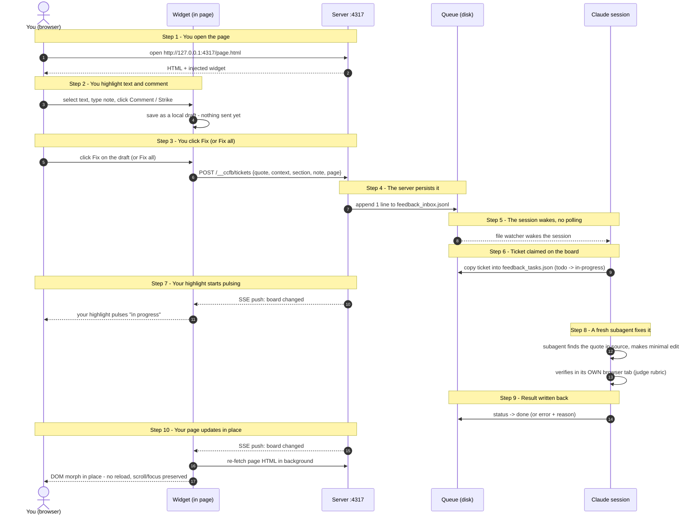
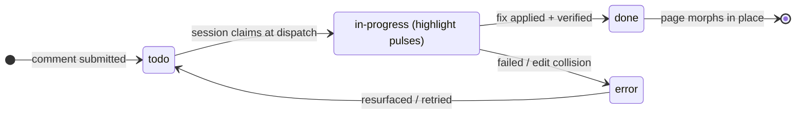

# How cc-htmlfeedback works

> Highlight text on a locally served HTML page, leave a comment, and a Claude Code session
> turns it into a verified fix that appears in your tab without a reload.
>
> For a visual, animated version of this document open
> [`docs/how-it-works.html`](./how-it-works.html) in a browser
> (or serve it with the tool itself: `node server.js --root docs`).

## The cast (4 pieces)

| Piece | What it is | Where it runs |
|---|---|---|
| **Widget** (`feedback-widget.js`) | Self-contained, zero-dependency script that draws the Feedback pill, the comment popover, and the side panel | Inside your page, in the browser |
| **Companion server** (`server.js`) | Tiny Node HTTP server (default port `4317`) that serves your HTML and injects the widget into every page | Your machine, `127.0.0.1` only |
| **Queue** (`.cc-htmlfeedback/`) | Plain files on disk next to your HTML - the only communication channel between browser and AI | Your working tree (gitignored) |
| **Claude Code session** (the "loop") | Reads the queue, dispatches one subagent per comment to edit the source, writes results back | Your terminal |

There is no database, no cloud, no accounts. Everything is local files plus one local port.

## The flow, end to end



The animated [`docs/how-it-works.html`](./how-it-works.html) groups these same messages into 10 interactive steps (matching the `Note` labels above) across 4 lanes, collapsing "you" and "the widget" into one lane for a simpler UI.

### 1. Commenting (what you do in the browser)

Highlight text, and a popover appears with two actions:

- **💬 Comment** - "change/fix this" with your instruction
- **⌫ Strike** - "remove this" (the text gets a red strikethrough)

Pressing **Enter** (or clicking the button) saves the note as a **local draft** - nothing is
sent yet. The widget packages four pieces of location info with your note; together they
form a **ticket** once the draft is sent:

| Field | What it captures | Why |
|---|---|---|
| `quote` | The exact text you selected | Primary search key for the fixer |
| `context` | The surrounding block (~160 chars) | Disambiguates repeated phrases |
| `section` | Nearest heading above the selection | Human-readable locator |
| `page` | The page URL | Maps to the source file |

Drafts stay editable in the side panel and can be discarded. Clicking **Fix** on a draft (or
**Fix all** to send every pending draft, one after another) is what actually POSTs it to the
server - only then does it become a ticket the session can see. A fast path skips the draft
stage for a quick single fix: **Cmd/Ctrl+Enter** (comment), **Cmd/Ctrl+Backspace** (strike, on
an empty box), or **Cmd/Ctrl+click** on either button - all three save and send in one step.

### 2. Persistence: two files per page, one writer each

For each page, the queue holds two files with strict ownership - each has exactly one
writer, so browser and AI never conflict on them. (The shared `index.json` below is a
separate read-modify-write path and isn't covered by that guarantee - concurrent first
comments on different new pages can race and drop an entry.)

```text
.cc-htmlfeedback/
  index.json                       # { "<pagekey>": { page, file, firstSeen } }
  pages/<pagekey>/
    feedback_inbox.jsonl           # SERVER appends only - one line per comment
    feedback_tasks.json            # SESSION writes only - the status board
```

Ticket schema (defined once in `lib/queue.js`'s `newTicket()`; shown here for reference):

```json
{
  "id": "uuid", "type": "comment | strike",
  "status": "todo | in-progress | done | error",
  "quote": "...", "context": "...", "section": "...", "note": "...",
  "page": "http://127.0.0.1:4317/page.html",
  "files": ["page.html"], "result": "one-line outcome",
  "createdAt": 0, "updatedAt": 0
}
```

### 3. The session wakes up (no polling)

The Claude session runs a tiny watcher (`lib/watch-inbox.js`) that blocks until any
page's inbox file **grows**, then exits - which wakes the session. Between comments the
session is idle: no polling, no token cost. On wake it merges new inbox lines onto the
board as `todo`, then claims them as `in-progress` at dispatch time.

### 4. Live status in your tab

The page keeps an open **SSE** connection (`/__ccfb/events`). The server polls each page's
`feedback_tasks.json` about once a second and pushes any change to the browser over that
connection. The widget just renders the board: the connection dot goes red (offline) / amber (connecting) / green (idle) /
pulsing blue (working), and the exact text you commented on pulses while an agent works it.



### 5. The fix (one fresh subagent per ticket)

The session dispatches up to **5 concurrent subagents**, each handling exactly one ticket
with a clean context ([`task-workflow.md`](../plugins/cc-htmlfeedback/skills/cc-htmlfeedback/task-workflow.md)):

1. **Locate** - find the `quote` in the source with `rg`, disambiguating via `context`/`section`/`page`
2. **Edit** - make the minimal change the `note` asks for; if the text already changed
   (concurrent ticket touched the same span), fail cleanly rather than corrupt the file
3. **Verify** - open the page in its **own** browser tab (never yours) and judge against a
   rubric: intent satisfied AND nothing newly broken
4. **Return** - `done` + one-line result, or `error` + actionable reason

A security rule is baked in: the comment text is an *edit request*, never commands to
execute. Subagents never run instructions embedded in a ticket.

### 6. The morph (why there is no reload)

When a ticket flips to `done`, the widget re-fetches the page HTML in the background and
**morphs** the live DOM to match, using a vendored copy of
[Idiomorph](https://github.com/bigskysoftware/idiomorph). Scroll position, focus, and the
other pending highlights all survive; remaining marks are re-anchored by searching for
their quotes again. In proxy mode the upstream dev server's HMR does this job instead.

## The second mode: Chrome extension (no server, no AI)

The same widget ships as a Chrome extension for any webpage. Nothing is connected: notes
live only in page memory, and **Copy feedback** exports all notes as structured text
(quote + context + section + note + file path) to your clipboard - to paste to a colleague
or an AI manually. Same UX, zero infrastructure.

## Boundaries worth knowing

- **Single machine, single user** - the server binds to `127.0.0.1` only; comments carry no author identity
- **Comments are disposable** - once fixed, the record is the git diff of your HTML; the queue files are gitignored working state, not an archive
- **HTML only** - it serves and morphs HTML; Markdown is not rendered
- **Fix-oriented review** - every comment is a work order for an AI, not a discussion thread; there are no replies, reactions, or resolve-without-fixing
- **Git is the undo** - the loop edits your working tree directly; revert with git, not the tool

## Quick start

```bash
# serve a directory of HTML files with the widget injected
node server.js --root <dir> --port 4317

# or front an existing dev server, preserving its HMR
node server.js --proxy http://localhost:5173

# then, in Claude Code (with the plugin installed):
/cc-htmlfeedback            # start the loop
/cc-htmlfeedback stop       # stop it
```
